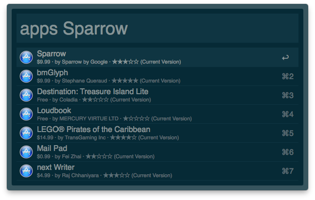

# alfred-appstore-search

This is a Alfred 2.0 Workflow to search the Mac App Store.

It works by calling the iTunes Search API to find Apps matching the query, and then presents the results to the user as Alfred Feedback. The user can then choose a result to open it in the Mac App Store application.

## Installation

To install this Workflow, clone the repository to your Alfred Workflows folder:

    $ git clone --recursive https://github.com/Ahti/alfred-appstore-search.git\
      ~/Library/Application Support/Alfred 2/Alfred.alfredpreferences/workflows/appstore-search

If you want to have the files in a location that is easier to access, you can also clone the repo to some folder of your choice and link that into Alfreds Workflow folder.

## Setup

By default, this Workflow searches the US App Store. If you want to change this, open the Workflow in Alfreds preferences, double-click the Script Filter object and change `set_lang('en')` to something else, for example `set_lang('de')`. 